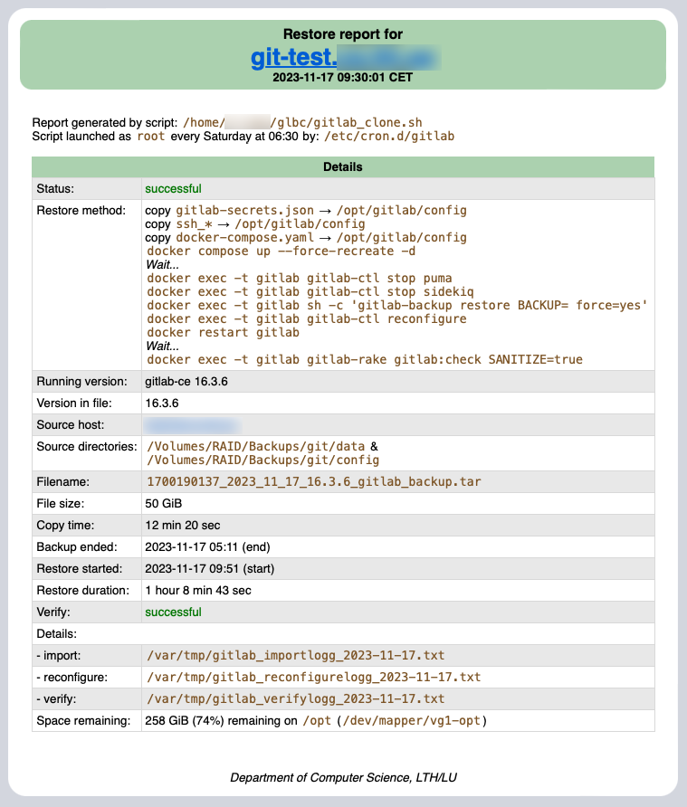

# GLBC
GitLab Backup and Clone

**GLBC** is a set of two `bash`-scripts doing the very common function of:

  1. Creating a backup of a GitLab server (`gitlab_backup.sh`)
  2. Restore that backup to another server, such as a testserver (`gitlab_clone.sh`)

The backup file is stored on a separate file server (`RemoteHost`).

-----

### Assumptions

  * A docker based GitLab system, running on a Linux system
  * A `/opt/gitlab/docker-compose.yaml` file
  * A remote server to store the backups and important files _(`gitlab-secrets.json`, `docker-compose.yaml` and `ssh_*`)_
  * Working `scp` and `rsync` and access between the machines involved

-----

### Functional core

The core of the backup script is:  
`gitlab-backup create`

The core of the restore script is:  
`gitlab-backup restore BACKUP=BackupFile.tar force=yes`

Additionally, the following files are copied to the storage server and restored to the test-server:

  * `gitlab-secrets.json`
  * `docker-compose.yaml`
  * The `ssh_*` files (certificates)

-----

### Settings file

In order to work, a settings file is required.

#### .gitlab_backup.settings
```bash
GitServer="git.dns.name"
LocalBackupDir="/opt/gitlab/data/backups"
LocalConfDir="/opt/gitlab/config"
RemoteUser="username"
RemoteHost="storage.dns.name"
RemoteDataPath="/some/directory/data"
RemoteConfPath="/some/directory/config"
RemoteHostKind=darwin
BackupSignalFile=/opt/gitlab/embedded/service/gitlab-rails/tmp/backup_restore.pid
BackupOptions='SKIP=builds,artifacts,registry STRATEGY=copy'
StopRebootFile=/tmp/dont_reboot
Recipient=user@system.dns.name
DeleteFilesNumDays=2
ReportHead=https://fileadmin.cs.lth.se/intern/backup/custom_report_head.html
USE_HTML_EMAIL=true
```

A note on the `ReportHead`:  

  * it should contain the first part of the complete html page, from `<!DOCTYPE html...` to `</head>`
  * the rest will be completed by the script itself (i.e. from `<body>` to `</html>`)


## Output

The scripts will send reports to a email (if given in the settings file) after processing is done.

### gitlab_backup.sh

Unless `USE_HTML_EMAIL`is `true`, a text-only report will be generated:
```text
Backup report from git.dns.name (script: "/home/username/glbc/gitlab_backup.sh") at 2023-09-07 04:56 CEST

BACKUP of git.cs.lth.se:
=================================================
File name:        1694052066_2023_09_07_16.3.1_gitlab_backup.tar
File size:        48 GiB
Version in file:  16.3.1
Backup started:   2023-09-07 04:00 CEST
Time taken:       36 min 30 sec
Space:            89 GiB remaining on /opt/gitlab/data/backups

RSYNC to storage.dns.name:
=================================================
Backup directory: /opt/gitlab/data/backups  ->  /some/path/Backups/git/data
Config directory: /opt/gitlab/config  ->  /some/path/Backups/git/config
Number of files:  1
Bytes trasferred: 49,434 MiB
Time taken:       19 min 37 sec
```
Otherwise, a more comple HTML-report is generated:  


### gitlab_clone.sh

Similarly, a text-only report is given for the cloning unless `USE_HTML_EMAIL`is `true`:
```text
Restore report from git-test.dns.name (script: "/home/username/glbc/gitlab_clone.sh")  at 2023-09-07 07:10 CEST

Gitlab restored successfully.

Details:
=================================================
Running version:   gitlab-ce 16.3.1
Version in file:   16.3.1
Source:            storage.dns.name:/some/path/Backups/git
Filename:          1694052066_2023_09_07_16.3.1_gitlab_backup.tar
Backup ended:      2023-09-07 04:36 (end)
Restore started:   2023-09-07 06:44 (start)
Restore duration:  40 min 0 sec
File size:         48 GiB
Space remaining:   110 GiB remaining on /opt/gitlab/data/backups
Verify:            correct
Details:
- import:          /var/tmp/gitlab_importlogg_2023-09-07.txt
- reconfigure:     /var/tmp/gitlab_reconfigurelogg_2023-09-07.txt
- verify:          /var/tmp/gitlab_verifylogg_2023-09-07.txt
```
Here also, the HTML-report is more complete:  

